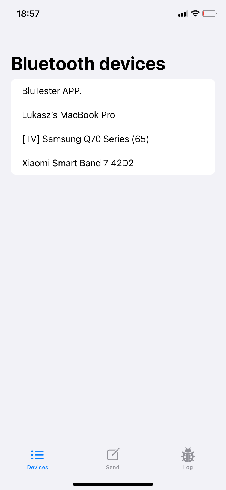

# BluTester
This is sample SwiftUI app with simple CoreBluetooth/BLE framework implementation. 
iOS app running on iPhone 11 sends text to be displayed on LCD screen. 
 
Arduino UNO Wifi was used as hardware including BBMobile BLE module. 
The project is not optimised as lack of BLE module specification. 
 
Example: 
  
  

  
SwiftUI, CoreBluetooth, BLE
